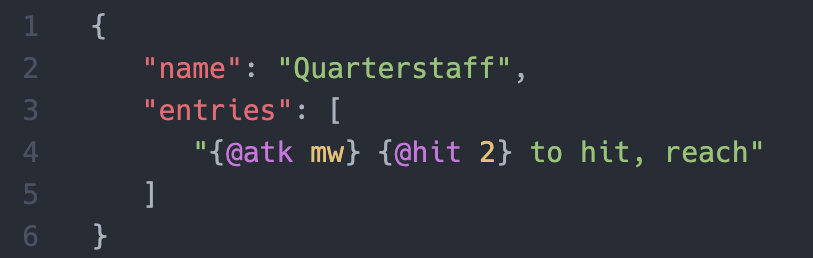
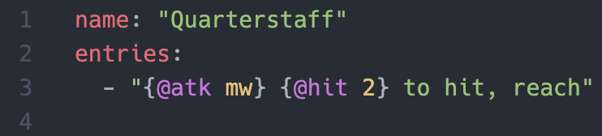

# 5e Tools TextMate Grammar

Enables syntax highlighting for [5e.tools](http://5e.tools) tags required in homebrew. This extension is much more thorough than my previous one, which if for some reason you want you can find it [here](https://github.com/Jklein64/5e-tools-tags). Also adds some snippets for tags. For more snippets, check out [GoR's 5eT Homebrew Snippets extension](https://github.com/Git-GoR/5eT-homebrew-snippets).

## Features

Highlights tags, such as `{@hit 5}` and `{@item Alchemy Jug|DMG}`, inside of both JSON and YAML files. Pairs well with [5e.tools JSON schemas](https://github.com/Jklein64/5e-schema).

Example of JSON highlighting:


Example of YAML highlighting (only works inside double quotes):


## Extension Settings

Since this extension uses TextMate grammar for syntax highlighting, the colors are controlled by your theme. I built it with the [One Dark Pro](https://marketplace.visualstudio.com/items?itemName=zhuangtongfa.Material-theme) theme in mind. If you want to use these colors with a different theme (or override them), add the following to your `settings.json` (either User or Workspace):

```json
{
	// ... other parts here
	"editor.tokenColorCustomizations": {
		"textMateRules": [
			{
				"scope": ["punctuation.separator.5e", "punctuation.brace.open.5e", "punctuation.brace.close.5e"],
				"settings": {
					"foreground": "#ABB2BF"
				}
			},
			{
				"scope": "constant.language.5e",
				"settings": {
					"foreground": "#D19A66"
				}
			},
			{
				"scope": "value.variable.5e",
				"settings": {
					"foreground": "#E5C07B"
				}
			},
			{
				"scope": "value.variable.rest.5e",
				"settings": {
					"foreground": "#61AFEF"
				}
			},
			{
				"scope": ["keyword.language.name.5e", "keyword.language.symbol.5e"],
				"settings": {
					"foreground": "#C678DD"
				}
			},
			{
				"scope": "keyword.asterisk.5e",
				"settings": {
					"foreground": "#56B6C2"
				}
			}
		]
	}
	// ... other parts here
}
```

## Known Issues

-   Snippets don't work inside of JSON strings (see [this](https://github.com/microsoft/vscode/issues/110058)). If you want to use them, you'll need to use YAML and write a script to convert it.

## Release Notes

### 0.0.1

Initial release of **5e Tools TextMate Grammar**
